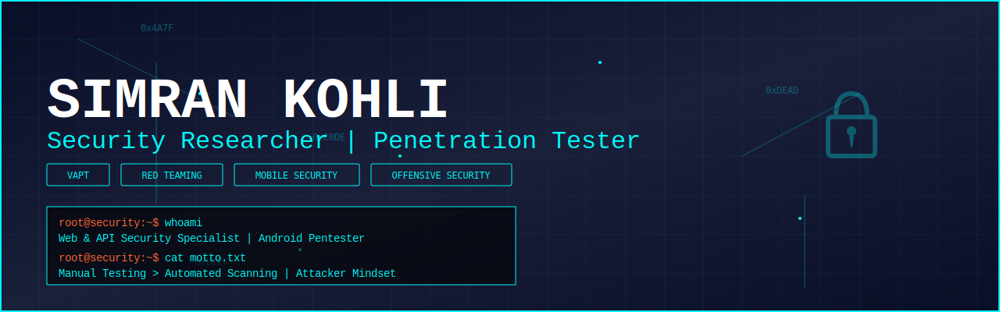
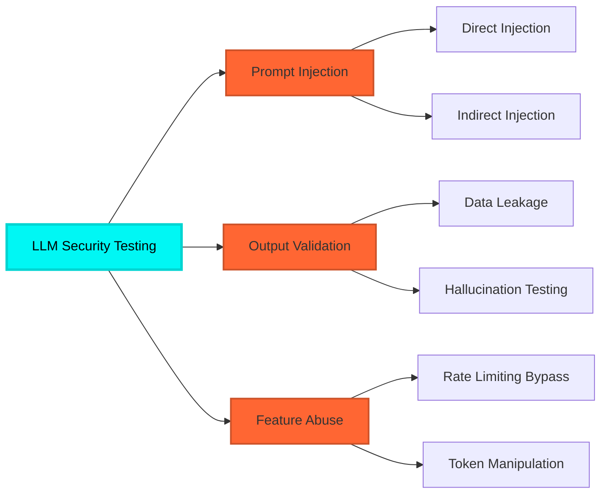

<div align="center">

```ascii
 ██████╗██╗   ██╗██████╗ ███████╗██████╗     ███████╗███████╗ ██████╗██╗   ██╗██████╗ ██╗████████╗██╗   ██╗
██╔════╝╚██╗ ██╔╝██╔══██╗██╔════╝██╔══██╗    ██╔════╝██╔════╝██╔════╝██║   ██║██╔══██╗██║╚══██╔══╝╚██╗ ██╔╝
██║      ╚████╔╝ ██████╔╝█████╗  ██████╔╝    ███████╗█████╗  ██║     ██║   ██║██████╔╝██║   ██║    ╚████╔╝ 
██║       ╚██╔╝  ██╔══██╗██╔══╝  ██╔══██╗    ╚════██║██╔══╝  ██║     ██║   ██║██╔══██╗██║   ██║     ╚██╔╝  
╚██████╗   ██║   ██████╔╝███████╗██║  ██║    ███████║███████╗╚██████╗╚██████╔╝██║  ██║██║   ██║      ██║   
 ╚═════╝   ╚═╝   ╚═════╝ ╚══════╝╚═╝  ╚═╝    ╚══════╝╚══════╝ ╚═════╝ ╚═════╝ ╚═╝  ╚═╝╚═╝   ╚═╝      ╚═╝   
```
##  About Me

Security Researcher with hands-on experience in **Web, API, and Android Application Security Testing**, focused on identifying real-world vulnerabilities through manual testing, exploitation, and structured reporting.

```python
class SecurityResearcher:
    def __init__(self):
        self.name = "Simran Kohli"
        self.role = "Security Researcher"
        self.location = "India"
        self.specialization = ["VAPT", "Red Teaming", "Mobile Security", "Offensive Security"]
        self.mindset = "Attacker Perspective + Defense in Depth"
    
    def current_focus(self):
        return ["Web Application Pentesting", "API Security", "Android Security", "LLM Security"]
    
    def methodology(self):
        return "Manual Testing > Automated Scanning"
```

---

##  Technical Arsenal

<details open>
<summary><b>Vulnerability Assessment & Penetration Testing</b></summary>
<br>

<table>
<tr>
<td width="50%">

**Application Security**
- Web Application Penetration Testing
- API Security Testing (AuthN/AuthZ, Rate Limiting, Logic Flaws)
- Android Application Security Testing
- Thick Client Application Testing
- Business Logic & Access Control Testing

</td>
<td width="50%">

**Infrastructure & Cloud**
- Network Penetration Testing
- Cloud Security Testing (AWS)
- SAST & DAST Implementation
- Security Architecture Review
- Vulnerability Management

</td>
</tr>
</table>

</details>

<details open>
<summary><b>Security Frameworks & Standards</b></summary>
<br>

<div align="center">

| Framework | Focus Area | Proficiency |
|-----------|------------|-------------|
|  | Web Top 10 | ████████████ 100% |
|  | API Top 10 | ████████████ 100% |
|  | Mobile Top 10 | ███████████░ 95% |
|  | Threat Framework | ██████████░░ 85% |

</div>

</details>

---

##  Weaponry & Tools

<details open>
<summary><b>Web, Network & Cloud Security</b></summary>
<br>


</details>

<details open>
<summary><b>Android Application Security</b></summary>
<br>


</details>

<details open>
<summary><b>Exploitation & Utilities</b></summary>
<br>


</details>

<details open>
<summary><b>Development & Automation</b></summary>
<br>


</details>

---

##  Automation & Scripting

```bash
#!/bin/bash
# Custom security automation toolkit

function reconnaissance() {
    echo "[+] Passive reconnaissance in progress..."
    # Subdomain enumeration, port scanning, service detection
}

function vulnerability_scanning() {
    echo "[+] Identifying potential attack vectors..."
    # Custom nuclei templates, automated fuzzing
}

function exploitation() {
    echo "[+] Attempting controlled exploitation..."
    # Python-based exploit scripts, privilege escalation
}

function reporting() {
    echo "[+] Generating comprehensive security report..."
    # Automated CVSS scoring, evidence compilation
}
```

**Key Capabilities:**
- Custom Python pentesting scripts for automated reconnaissance and exploitation
- Bash workflow automation for repetitive security tasks
- API interaction scripts for testing and fuzzing
- Custom payload generators and encoders
- Automated report generation and evidence collection

---

##  AI & LLM Security Research

<div align="center">



</div>

**Foundational Research Areas:**
- Prompt Injection Attack Vectors (Direct & Indirect)
- LLM Output Validation & Data Leakage
- AI Feature Abuse & Misuse Testing
- Model Behavior Manipulation
- AI-Powered Application Security Testing

---

##  Training Grounds & Labs

<div align="center">

| Platform | Focus | Progress |
|----------|-------|----------|
|  | Web Security Academy |  |
|  | Offensive Security Paths |  |
|  | Realistic Pentesting |  |
|  | Android APK Analysis |  |

</div>

**Lab Environment:**
- Dedicated home lab for Android dynamic analysis and reverse engineering
- Custom vulnerable applications for testing methodologies
- CTF participation and challenge creation
- Detailed writeups and proof-of-concepts available in pinned repositories

---

##  Research & Documentation

<div align="center">

```ascii
┌─────────────────────────────────────────────────────────────┐
│  RESEARCH AREAS                                             │
├─────────────────────────────────────────────────────────────┤
│  → Web Application Exploitation Techniques                 │
│  → API Security Vulnerabilities & Attack Chains            │
│  → Android Application Reverse Engineering                 │
│  → Red Team Tactics, Techniques & Procedures               │
│  → Vulnerability Assessment Methodologies                   │
│  → Security Architecture Analysis                           │
└─────────────────────────────────────────────────────────────┘
```

</div>

**Content Portfolio:**
- In-depth exploitation walkthroughs with step-by-step analysis
- Android vulnerability research and dynamic analysis reports
- Red Team engagement simulations and adversary emulation
- Comprehensive vulnerability assessment report samples
- Security tool development and usage guides
- CVE analysis and remediation strategies

**All detailed documentation, writeups, and proof-of-concepts are available in pinned repositories below**

---

##  GitHub Analytics

<div align="center">


</div>

---

##  Connect & Collaborate

<div align="center">

[](mailto:simrankohli628@gmail.com)
[](www.linkedin.com/in/simran-kohli-a9072630a)
[](https://simrankohli.netlify.app)

</div>

---

<div align="center">

###  Core Philosophy

```python
security_mindset = {
    "testing_approach": "Manual testing over automated dependency",
    "perspective": "Think like an attacker, defend like a guardian",
    "documentation": "Clear, structured, actionable reporting",
    "methodology": "Comprehensive + Methodical + Detail-oriented",
    "learning": "Continuous evolution in the security landscape"
}
```

**"Break it. Document it. Fix it. Repeat."**

---


<sub>Last updated: January 2026</sub>

</div>
